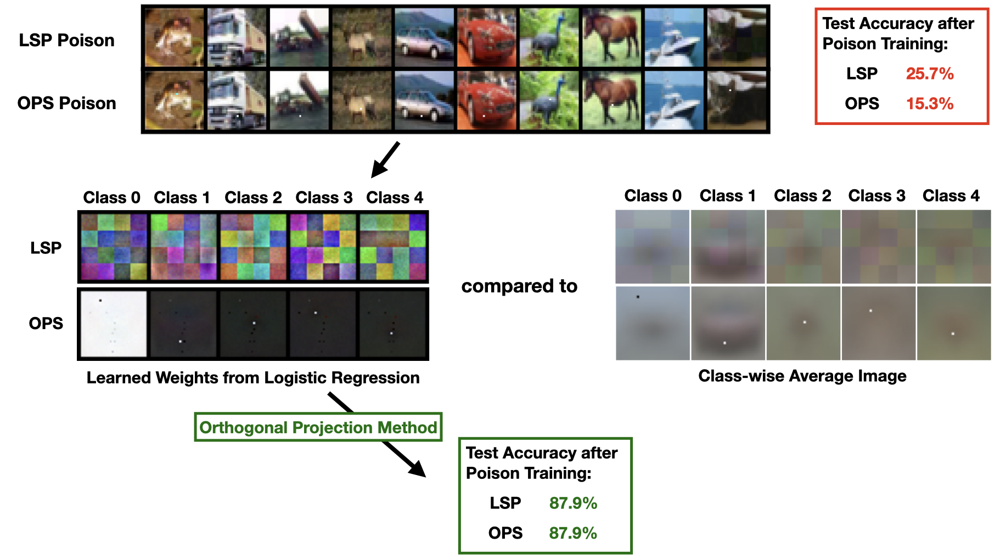

# learn-from-unlearnable
Code for the paper [What Can We Learn from Unlearnable Datasets?](http://arxiv.org/abs/2206.03693) by Pedro Sandoval-Segura, Vasu Singla, Jonas Geiping, Micah Goldblum, Tom Goldstein. (Accepted to NeurIPS 2023)

  

Our Orthogonal Projection method can recover class-wise perturbations and remove them to allow for learning from poisoned data. <b>(Top)</b> A batch of 10 poisoned images from [LSP Poison](https://dl.acm.org/doi/10.1145/3534678.3539241) and [OPS Poison](https://openreview.net/forum?id=p7G8t5FVn2h). <b>(Middle)</b> Recovered perturbations after training a logistic regression model compared to computing a class-wise average image. <b>(Bottom)</b> After projecting the poisoned data, a ResNet-18 can train and achieve high test accuracy.

## Setup instructions

## Reproduce Results
#### Section 4.2: DNNs can learn useful features from unlearnable datasets

#### Section 4.3: Linearly separable perturbations are not necessary 

#### Section 4.4: Orthogonal projection for learning from datasets with class-wise perturbations
